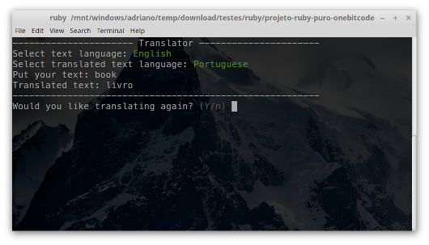
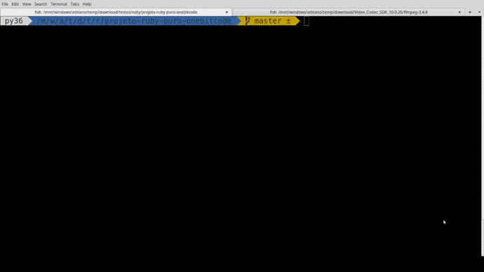

# Projeto do Curso Ruby Puro do OneBitCode
<p>

<a href="https://github.com/adrianoavelino">
    
</a>

<a href="https://github.com/EliasGcf/readme-template/commits/master">

</a>
</p>



Projeto Final do Curso https://onebitcode.com/course/ruby-puro/

A execução do projeto está disponível no [Youtube](https://www.youtube.com/watch?v=405zS5PAL3U)

## Introdução
Este é o projeto final do Curso Ruby Puro do OneBitCode. A missão do projeto era criar uma aplicação CLI (Command Line Interface) que traduz textos

## Desafio

### Missão
Crie um software que permita que o usuário entre com um texto, o idioma em que o texto está escrito e também o idioma para qual ele deseja traduzir o texto e receba como resposta na tela o texto traduzido.

### Critérios
Você deve utilizar orientação a objetos no seu software
O resultado de cada tradução (junto com a frase original) deve ser guardado em um arquivo que possua no nome a data e horário da tradução (exp: 10-10-18_10:30.txt)

### Recursos
- Para realizar as chamadas Web utilize a Gem Rest Client (documentação): https://github.com/rest-client/rest-client
- Para realizar a tradução utilize a API do Yandex.
Crie sua conta e pegue seu Token de autenticação nesta URL: https://translate.yandex.com/developers/keys
Veja como realizar a chamada nessa URL: https://tech.yandex.com/translate/doc/dg/reference/translate-docpage/

## Pré requisitos
- git (somente para clonar o projeto)
- ruby 2.5.1
- bundler (`gem install bundler`)
- conta no [Yandex](https://translate.yandex.com/developers/keys)
- Sistema Operacional Linux (testei somente no Linux Mint)

## Começando
```bash
#clone o projeto
git clone https://github.com/adrianoavelino/projeto-ruby-puro-onebitcode.git

#entre no diretório
cd projeto-ruby-puro-onebitcode

#instale as dependências
bundle install

#execute o app
ruby app.rb
```

[](https://www.youtube.com/watch?v=405zS5PAL3U)
